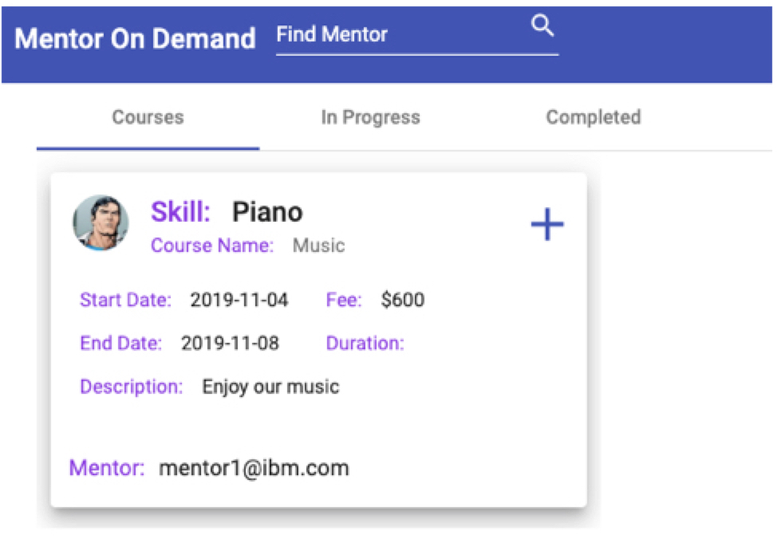
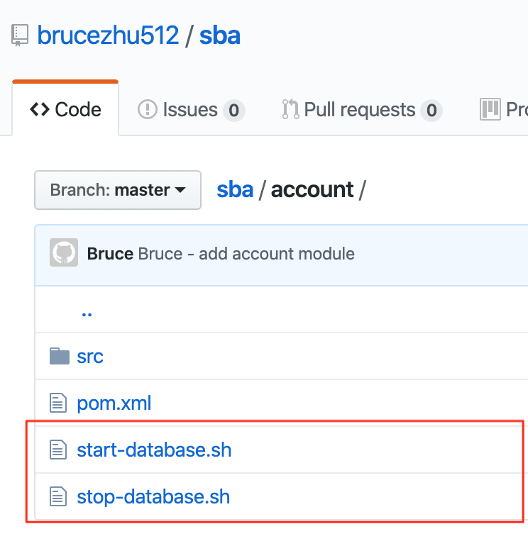

# SBA

Github: https://github.com/brucezhu512/sba

## Overview

| Modules  | Description                                                  |
| -------- | ------------------------------------------------------------ |
| account  | Account service, this service model takes care of user info (Login user). |
| auth     | In charge of authentication                                  |
| course   | Course service, this service model takes care of course information. |
| payment  | Payment service, this service model takes care of payment information. |
| gateway  | API Gateway, the only portal for front end project. (Should run by second) |
| registry | Registry center (Should run by first)                        |
| frontend | Front-end application                                        |

## User Interface

Mentor can add the course page:

Sign Up page (Can sign up as a user or a mentor):


After sign up as a mentor, after login he can add Courses.


Normal user can find courses added and apply!


Normal user can also view the applied courses by pushing the “plus” button above.


## Dockerization

For Each service (Mysql), we use docker containers for them.
For example: https://github.com/brucezhu512/sba/tree/master/account


For Mysql:

```shell
docker run -d --name account-mysql \  
	-e TZ='Asia/Shanghai' \  
	-e MYSQL_DATABASE=sba_account \  
	-e MYSQL_ROOT_PASSWORD=123456 \  
	-p 32001:3306 \  
	mysql:5.7 \  
	--character-**set**-server=utf8 \  
	--skip-character-**set**-client-handshake=1  
```

 For App:

```shell
docker run -it --name account-app \  
	-p 8084:8080 \  
	-v `pwd`/target/account -0.0.1-SNAPSHOT.jar:/apps/springboot.jar \  
	-e "SPRING_PROFILES_ACTIVE=prod" \  
	openjdk:8-jdk java \  
	-jar /apps/springboot.jar  
```

## CI

I ran the Jenkins as docker container from an in internal server by script:
```shell
docker run -p 8080:8080 -p 50000:50000 \  
	-v /Users/will/Documents/jenkins:/**var**/jenkins_home \  
  	--name sba-jenkins -idt jenkins 
```

